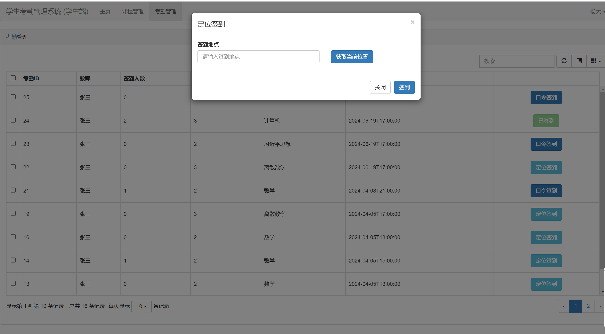

# django学生考勤管理系统
> 基于django的学生考勤管理系统，具有可视化，教师管理，学生管理，考勤统计，考勤记录，邀请注册等功能，分为学生，教师，管理员三个角色。


## 部分项目简单展示

### 学生端




### 教师端


### 管理员端


## 运行
1.下载项目
```shell
git clone https://github.com/duanguolei/students_management.git
```

2.下载依赖
```shell
cd students_management
```
```shell
pip install -r requirements.txt
```

3.配置环境

> 并配置mysql,redis

4.迁移数据库
```shell
python manage.py makemigrations

python manage.py migrate
```

5.运行
```shell
python manage.py runserver
```

访问: http://127.0.0.1:8000/login

## 注意
### 1.注册
管理员，教师注册，需要运行脚本生成注册码
```shell
python web/scripts/load_invite_sign.py
```
生成后点击注册码，跳转到注册位置
### 2.定位
定位采用腾讯地图api,网上找的一个，可能失效请自行更改,见配置文件

---

__代码中存在一定逻辑漏洞，不完善之处，欢迎点评指正__
